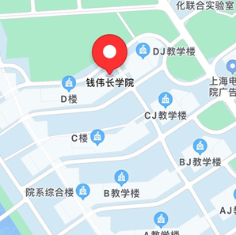
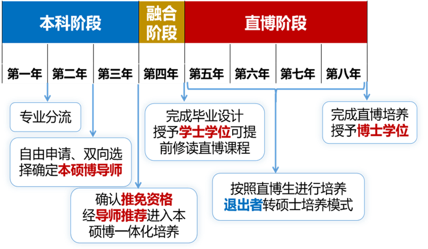

# 2022级钱伟长学院新生适应性指南

[TOC]

## 零.序

《钱伟长学院新生适应性指南》是一份在整合往届已有的迎新资料的基础上，根据2021级的实际经历进行修改与添加而得到的迎新手册。这是往届的学生送给各位钱伟长学院新生们的第一份礼物。在各位急忙开启精彩且充实的大学生活前，谨以此代表我们最诚挚的祝福。希望这份指南能或多或少地帮助到各位。（如有出入，请向当届导生反应。）

## 一.关于钱伟长学院

### 1.1欢迎来到钱伟长学院

欢迎各位来到钱伟长学院！！！！

钱伟长学院以上海大学老校长、著名科学家、教育家、社会活动家钱伟长先生名字命名，既是17所"国家试点学院"之一，也是教育部首批"三全育人"试点院（系）之一。学院依托上海大学进入全球前1%的数学、物理、化学、材料科学与工程、生物等优势学科，联合相关学院、系（所），实施"重基础、跨学科、国际化"的人才培养战略，致力于培养具有扎实基本功、全球视野的基础学科拔尖创新人才和前沿交叉学科拔尖创新人才，造就未来的学术领军人物。 钱伟长学院按照"理科试验班类（选考物理）"和"理科试验班（选考化学）"进行招生。理科试验班类含数学与应用数学、应用物理学、理论与应用力学和材料设计科学与工程四个专业，理科试验班包含应用化学和生物工程两个专业。

钱伟长学院现任领导是钱伟长学院党委书记吴蔚老师，党委副书记、院长周全，党委副书记、副院长沈青松老师，副院长许新建老师、任伟老师，而2022级的辅导员是魏仲奇老师（**宝藏老师！！！**）。钱伟长学院拥有上海大学领先的师资力量与学习条件，能帮助有志于学的伟长学子们实现个人的理想，这里也是专业学科交叉融合的示范学院，在大一的一年你能体会到各个专业的特色和魅力，帮助你选择自己的梦想专业，同时钱伟长学院也是一个温暖的大家庭，你会像高中一样认识许多学院里的同学，互帮互助，愿诸位能在钱院收获友谊与智慧！

### 1.2关于钱伟长学院

#### 1.2.1 三学期制

钱伟长学院是上海大学的招牌之一。为了实现和国际对接，钱伟长先生在设立上海大学学期制度时便高瞻远瞩地选择了和国外相同的"三学期制"。

> **三学期制：**
>
> 上海大学把一个学年分成了三个教学学期（秋、冬、春）+一个夏季实践学期。每个学期只有约12周（10周上课+2周考试）。学校会在一个学年开始时发放一整年的**校历（一张纸质日历）**，从中可以具体了解到假期、各类活动的时间安排。作为上海大学的学生，各位可以利用空闲的考试周错峰旅游，休息。
>
> 上海大学一整年的学期时间安排大致是：秋季学期12周，之后**直接连着**冬季学期6-9周（根据实际情况而定），接下来是放寒假，寒假回来继续冬季学期剩下的几周，之后**连着**春季学期12周，再是4周的夏季学期，最后放暑假。
>
> 冬季学期在寒假前是不进行期末考试的，寒假期间要注意**复习**，回校一般2-3周后开始考试。夏季学期会用于各种社会实践活动、金工实习、旅游、学习技能、看书、预习，如果还有余力，可以选报国际化课程。
>
> 在三学期这个制度中，学生的休息时间和学习时间会被近乎平均地分配到12个月中，在这样一种与之前初高中截然不同的制度下，假期不再是两个月或者一个月这样连续的时间了，取而代之的是假期被均匀地分配到一整个学年中。在这样的情况下，各位必须学会如何将放松和学习结合，做到张弛有度。
>
> All work and no play makes Jack a dull boy！

#### 1.2.2 住宿书院制

三学期制是上大所特有的制度之一，而钱伟长学院作为全国17所国家试点学院，更是考虑到了学生未来的发展。学院借鉴世界一流大学的书院育人模式，在上海大学率先探索设立了住宿书院制，让学院不同年级不同专业的学生同吃同住，以书院为载体促进师生交流，形成师生共同体，鼓励学生自主管理，从而使"三全育人"落地。（详见第五章）

#### 1.2.3 全程导师与学业导师制

学院共有六个专业，分别是应用化学、生物工程、材料设计科学与工程、理论与应用力学、数学与应用数学和应用物理。同时，为了贯彻钱伟长老校长的教育思想之一：**打穿教学和科研之墙壁**，学院创立了全程导师和学业导师制度，让每一位学生从进入钱伟长学院之际便可以与专业教授一起感受科研氛围。

> **全程导师与学业导师制：**
>
> 在大一入学之际，学院会聘请校内外优秀教授担任各位的全程导师。全程导师会参与学生培养，在学业规划、专业学习、科研探索和品德素养等方面进行全方位的指导，帮助各位顺利完成大学阶段的学习和成长，实现本科期间连续不间断的教育。到了大二分专业后，各位会有学业导师，学业导师则是为大家提供专业指导，进行学术引导，以实现个性化培养，各位的毕业论文也是在学业导师的指导下完成的。学业导师选择的时间通常是在大一至大二的暑期学期中间，建议在这之前仔细了解一下自己感兴趣的方向，并提前联系好导师。

#### 1.2.4 专业分流

一年级末，在完成第一学年基础强化课程学习并合格的基础上，依据学生第一学年的综合成绩及专业分流志愿，对学生进行综合考察排序，确定学生的专业，进入钱伟长学院不同专业学习。这次分流将决定各位主攻的学术方向，对于各位非常非常的重要，一定要仔细阅读专业分流的细则。下面以2021级专业分流细则为例，详细讲解一下。2022级会在该细则基础上稍加修改，但变化应该不会很大。（**请务必在2022级专业分流细则公布之后仔细阅读！！入学后不久就会发布！！**）

> **2021级专业分流细则：**
>
> 钱伟长学院秉承钱伟长教育思想，践行精英教育理念，实施"重基础、跨学科、国际化"的人才培养战略，致力于培养具有扎实基本功、全球化视野的跨学科、学术型创新人才。为实现学生的个性化培养，学院实行一年级末专业分流制度。为做好此项工作，现特制定钱伟长学院2021级学生专业选择和分流实施细则如下。
>
> **第一条、指导思想**
>
> 钱伟长学院的专业分流工作坚持公平、公正、公开的原则，坚持以学生为本，注重学生成才愿望，同时兼顾学院各专业教学资源配置。在完成第一学年基础强化课程学习并合格的基础上，对学生第一学年的学习成绩进行综合排序，再按照学生志愿和各专业招生计划对学生进行专业分流，进入后续专业培养。**第二条、基本原则**
>
> 1、组织保障
>
> 学院成立专业分流工作小组，由以下人员组成：
>
> 组长：院长、直属党总支书记
>
> 副组长：教学副院长、分管招生工作的副院长、直属党总支副书记
>
> 组员：院办主任、团委书记、年级辅导员和教学秘书
>
> 秘书：教学秘书
>
> 2、退出机制
>
> 2、退出机制
>
> 学院实行学生培养退出机制。符合以下任一条件的同学，将退出钱伟长学院，参加学校理工大类的专业分流，也不再享有国家试点学院的有关政策支持。
>
> （1）第一学年钱伟长学院绩点（详见附注1）在所在专业类排名后15%且低于2.8的学生；（注：如遇绩点相同的情况，按钱伟长学院计划内课程总成绩排序，退出人数以钱伟长学院一年级各专业类在读总人数×15%为基准向下取整。）
>
> （2）一年级末课外综合素质得分低于8.0分的学生；
>
> （3）本人申请，经学院专业分流工作小组讨论后确认不适应学院学习者。
>
> 3、专业选报
>
> 继续在钱伟长学院修读的学生需依据自身的意愿，在钱伟长学院开设的专业中按照高考选考科目要求进行选报。
>
> 理科实验班类(选考物理专业)：材料设计科学与工程、理论与应用力学、数学与应用数学、应用物理
>
> 理科实验班(选考化学专业)：生物工程、应用化学
>
> （1）学生按要求填报《钱伟长学院专业选择志愿表》；
>
> （2）学院在尊重学生志愿的基础上，依据本细则第三条所定之规则，综合考察学生的学习成绩、专业志向、创新思维、逻辑推理及表达能力，确定每位学生的专业方向；
>
> （3）每个专业方向计划人数如下：(注：专业计划数会根据实际退出情况有所调整，由学院专业分流工作小组确定。)
>
> 理科实验班类：
>
> 材料设计科学与工程：30名
>
> 理论与应用力学：30名
>
> 数学与应用数学：30名
>
> 应用物理学：30名
>
> 理科实验班：
>
> 生物工程+应用化学：35名(两个专业不做名额限制，具体人数根据选报人数确定)
>
> （4）志愿选报数学与应用数学专业的学生，大一的高等数学课程应完整修读模块1（详见附注2）。
>
> **第三条、专业分流规则**
>
> 1、数学专业招录规则：第一志愿报数学专业且完整修读模块1的学生中"总成绩"（详见附注3）排名在该专业计划人数前70%的同学直接录取至该专业；其余学生按志愿从前到后、每级志愿中以完整修读模块一者优先为原则按总成绩从高到低排序，学生以数学专业剩余名额的150%的人数进入面试环节，其中，根据数学专业的培养方案和先修课程要求，未完整修读模块一的学生须先加试笔试，笔试通过方可进入面试环节。如面试人数少于专业剩余名额，可直接录。
>
> 2、生物与化学专业规则：两个专业不做名额限制，具体人数根据选报人数确定，除了能力退出和意愿退出的学生外，其他学生按照所填志愿录取。
>
> 3、其他专业招录规则：各专业第一志愿的学生中总成绩排名在该专业计划人数前70%的同学直接录取至该专业；其余学生按志愿从前到后、每级志愿按总成绩从高到低排序，学生以各专业剩余名额的150%的人数分别进入各专业的面试环节。如面试人数少于专业剩余名额，可直接录。
>
> 3、面试
>
> \(1\) 答辩专家由学院教学指导委员会推荐，学院专业选择和分流工作小组讨论确定最终专家名单。每个专业方向不少于5名专家。
>
> \(2\) 专家根据答辩成绩排序，确定最终进入专业的名单。
>
> \(3\) 每个进入面试的学生只有一次参加答辩的机会，如果答辩未通过，则根据其志愿和成绩由学院分配到其他专业就读。
>
> 第四条、工作流程
>
> 1、秋季学期开学前：充分调研，制定"专业分流实施细则"。
>
> 2\. 秋季学期第1周：向学生进行解读分流政策，并公示。
>
> 3、春季学期第8周：课外综合素质得分评定。学院依据《钱伟长学院一年级末课外综合素质得分评定办法》对全体学生进行课外综合素质得分评定。意愿退出申报。所有学生填写《钱伟长学院专业分流志愿表》（附表1），由于对本学院专业不感兴趣而意愿退出钱伟长学院的学生还需填写《钱伟长学院意向分流申请表》（附表2）。
>
> 4、春季学期第9周：确定意愿退出学生名单。学院专业分流工作小组与提出意愿退出学院申请的学生进行个别面谈。经面谈沟通交流后确定要退出者填写相应承诺书；决定继续留在学院修读者重新填写《钱伟长学院专业分流志愿表》（附表1）。
>
> 5、夏季学期：公布绩点排名和课外综合素质评分，确定能力退出学生名单。面试、录取并公示。公布绩点排名和课外综合素质评分，学院按照第二条所规定的原则实施末位退出。对于继续在钱伟长学院修读的学生，按照第二条和第三条所规定的专业分流原则与规则，完成专业选择并予以公布。退出的学生，依据理工大类专业分流相关流程参与理工大类专业分流。学生依据专业培养计划选课，进入专业学习。
>
> 第五条 其他事宜
>
> \(1\) 由于参军、休学等原因与2021级学生同时进行大一末专业分流的往届学生，按照本实施细则进行专业选择。
>
> \(2\) 本实施细则自2021年9月1日起施行，有效期一年。
>
> \(3\) 本实施细则由上海大学钱伟长学院负责解释。
>
> 钱伟长学院
>
> 2021年9月
>
> 附注1：（钱伟长学院绩点计算公式：教务处成绩绩点×学分/（钱伟长学院计划内学分+选修学分），培养计划中没有要求必须在一年级修完的课程按选修课计算）
>
> 附注2：钱伟长学院高等数学教学并行分为两个模块，模块一为《数学分析（1-3）（特）》（课程号01015147-149）和《高等代数(Ⅰ-Ⅱ)(强)》（课程号00814379-380）；模块二为《工科数学分析（1-3）（强）》（课程号00814231-233）和《线性代数与空间解析几何（强）》（课程号00814097）。大一末志愿选择填报数学专业的学生应选择修读模块一，其他学生选择修读模块二。模块1的课程学分可以抵充模块二的课程学分，反之不可以。
>
> 附注3：总成绩=钱伟长学院绩点×90/4+综合素质评定得分。

以上为钱伟长学院2021级分流细则，接下来进行几点说明：

**1.2.4.1 退出机制**

钱伟长学院大学第一学年采用末位淘汰制和自愿退出制来筛选不适合在钱伟长学院中继续修习的同学。

末位淘汰制：在大一前三个学期（即大一秋季学期，冬季学期和春季学期中），**钱伟长学院绩点（并不是GPA）**在全院排名**后15%，并且**绩点低于2.8的同学（**二者必须全都满足**），将被动退出钱伟长学院。（具体实施办法请以当年公布的为准。）。

自愿退出制：学生可以在大一春季学期临近学期末时，向学院**递交出院申请**（如果想递交一定要注意时间！！具体时间辅导员会通知！），在经过专业分流小组讨论认为确实不适合在钱伟长学院修习者，可以进入大类分流。

第三种淘汰制度：每个人在三学期结束之后会得到一个"课外综合素质"得分。起评分是8分，满分是10分。评价规则如下：

> **1.加分**
>
> （一）根据学生获奖情况及课外总体表现给予加分（**最高一分**）：
>
> 2021-2022学年前三个学期中所修学分数不少于指导性教学计划规定学分数的90%且平均绩点不低于2.0，最多允许有2门功课不及格且当学年已通过重修取得学分，根据以下五类单项奖学金预评审条件进行申请。
>
> （1）领导力加分：当年度在学生工作、社会工作、社团建设、实践项目等方面取得突出成绩；担任院级及以上学生组织（含学生社团）负责人，任期满一年或所带学生组织获得校级及以上荣誉；担任学院基层班团组织负责人，并做出突出贡献者；担任院学生会部门的主要成员，且表现优秀；在领导力方面有其它突出表现并有可供认定材料。有以上情形的可以加0.2分；
>
> （2）创新创业加分：校级以上学术科创竞赛获奖的加0.2分；
>
> （3）文艺体育加分：在校级及以上体育竞赛活动中获得各类奖项；在校级及以上文艺竞赛活动中获得各类奖项；积极参加校级及校级以上文艺、体育竞赛活动中表现突出并有可供认定材料。有以上情形的可以加0.2分。
>
> （4）公益爱心加分：在各类志愿服务或实践活动中获得奖项；多次参与志愿服务或实践活动，表现突出并有可供认定材料；积极参与献血、中华骨髓库、爱心捐助等爱心奉献活动并有可供认定材料；在其它公益爱心方面有表现突出并有可供认定材料。有以上情形的可以加0.2分；
>
> （5）自强不息加分：当年度学业明显进步（学期进步30名以上）；在生活中自立、自强表现突出（成绩进步明显）的**困难生**。有以上情形的可以加0.2分；
>
> （二）根据民主测评结果可获加分（**最高一分**）：
>
> 测评前16%-20%（含20%）的学生加0.2分，测评前12%-16%（含16%）的学生加0.4分，测评前8%-12%（含12%）的学生加0.6分，测评前4%-8%（含8%）的学生加0.8分，测评前4%（含4%）的学生加1分。
>
> 以上各类加分，学生需提供相应的材料证明，学院课外综合素质评定工作小组进行严格审核，具体操作办法详见附件"钱伟长学院课外综合素质优秀学生民主评选实施办法"。
>
> **2.减分**

违反校纪校规或院纪院规，根据情节给予减分：

（1）情节较轻者给予1分以下的减分；

（2）情节严重者给予1至2分的减分。

（具体由钱伟长学院综合素质评定小组视学生的违纪情况讨论决定）

**（千万不要翘课啊！！！尤其是活动课！！！！别轻视任何一门课，要以认真的态度对待每一门课！！）**

按照以上规则获得课外综合素质分数，如果这个分数低于8分。就会被动出院。

（**一定要注意校规！！开学时会发学生手册，上面有校规，要仔细看看。**）

**1.2.4.2 专业分流**

专业分流的依据是"总成绩"，总成绩=钱伟长绩点×90/4+综合素质评定得分，总分100分。数学、物理、力学、材料**拟定**录取30人，而化学和生物人数不限。各专业按照学生在大一春季学期临近学期末时填写的专业分流志愿，**直接录取填报该志愿的前70%的同学**，剩下的名额先**预录取剩余名额的150%**，再通过面试环节，录取剩余名额。如果面试人数少于专业剩余名额，那么可以不用面试，直接录取。

这边需要特别讲一下数学专业的录取机制：理科实验班类的同学才能填写数学作为专业志愿。数学系优先录取选修模块一的同学，模块二的同学需要通过额外的考试才能被数学专业录取。

有一些特殊情况，如果一位同学即没有出院，同时也没有被他所填的前三个专业录取，那么学院会适当地增加某个专业的人数。总之，只要你不是被动出院的，就会有专业录取你。

**1.2.4.3 专业志愿的填报**

理科实验班类的同学**能且仅能**从数学、物理、力学和材料中选择，理科实验班的同学**能且仅能**从生物和化学两门专业中选取。不存在例外情况。**不可在大一学期末进行转专业从理科实验班类转到理科实验班，或从理科试验班转到理科试验班类。**

**1.2.4.4离开钱伟长学院之后**

离开钱伟长学院的学生，若不提出转专业申请，便进入**理工大类**进行分流。转专业的同学需要同学自己关注意向学院发布的转专业细则。

#### 1.2.5 钱伟长学院综合办公室

各位日后一定会有学业或者生活上的各种个性化的问题，这时候就需要向综合办公室的老师询问。老师们的联系方式和办公室如表一所示：

表一：各综合办公室老师的联系方式与办公室

| 姓名       | 职务                   | 办公室      | 办公室电话   |
| ---------- | ---------------------- | ----------- | ------------ |
| **吴 蔚**  | **党委书记**           | **D509a**   |              |
| **周全**   | **院长、副书记**       | **D505**    |              |
| **沈青松** | **党委副书记、副院长** | **D509a**   |              |
| **许新建** | **副院长**             | **F603**    |              |
| **任伟**   | **副院长**             |             |              |
| **苏 英**  | **办公室主任**         | **D509b**   | **66133082** |
| **唐 乐**  | **外事秘书、教务秘书** | **D509b**   | **66132033** |
| **马思夏** | **教务秘书**           | **D509b**   | **66133082** |
| **刘 佳**  | **组织员、人事干事**   | **D509b**   | **66132033** |
| **阮杜娟** | **总支委员、辅导员**   | **南二208** | **66136263** |
| **顾艳霞** | **辅导员**             | **南二208** | **66136263** |
| **魏仲奇** | **团委负责人、辅导员** | **南二206** | **66136192** |
| **周玫**   | **辅导员**             | **南二206** | **66136192** |

有课程相关的问题（比如选什么课，选错了课需要退课等）可以在工作时间向教务秘书唐乐老师询问。

**注意：请在老师的办公时间内向相关老师咨询其工作范围内的问题！！！**

**关于D楼五楼的前往方法**

**很多刚入学的学生都不知道如何前往D楼五楼，甚至有些人以为D楼五楼位于异次元。这边统一说一下，D楼五楼需要搭乘D楼东侧的电梯（即D楼和DJ楼中间的电梯）才能前往（其实D楼中部的楼梯也行，但很多同学找不到）。电梯位置如图一所示：**

**图一：前往D楼五楼的电梯所在位置（红点所示）**

### 1.3关于钱伟长先生

钱伟长，1912年10月9日-2010年7月30日，出生于江苏无锡，毕业于多伦多大学，世界著名科学家、教育家，杰出的社会活动家，中国近代力学、应用数学的奠基人之一。曾任中国科学院力学研究所副所长、研究员，上海大学校长，暨南大学董事会董事长等职。

他兼长应用数学、力学、物理学、中文信息学，在弹性力学、变分原理、摄动方法等领域有重要成就。

各位会在之后的钱伟长教育思想宣讲中详细得了解到钱老提倡的先进的教育思想。在此不再详述。

### 1.4 关于钱院的三大系列讲座

钱伟长学院有三大系列讲座，分别是：钱伟长讲坛、"梦想启航"系列讲座以及伟长学子讲坛。其中，钱伟长讲坛至今已办了59期，主要内容是有关不同领域内不同研究成果的报告，能够拓宽同学们的眼界，帮助同学们发掘自己的兴趣爱好和未来的方向。

而伟长学子讲坛则是由钱伟长学院的往届学生介绍他们自己的学习经验和生活经验，有时可以收获到适合自己的学习方式和生活节奏。

"梦想启航"系列讲座则是帮助同学们进行生涯规划或者教导同学们一些学术生活中的小技能。

总之，三大讲座内容精彩且丰富，是拓展个人能力、视野与思想的绝佳机会，一定不能错过哦！

### 1.5 本硕博一体化拔尖人才培养计划

自2022年起，学院开始实施本硕博一体化拔尖人才培养计划。该计划遴选热爱教育、造诣深厚、德才兼备的学术名师建设本硕博博导师资库，鼎力实施大师引领、大项目牵引、大平台支撑的培养模式。下面简单介绍此计划。

本硕博一体化拔尖人才培养计划采取3+1+X（学制8年）的学制。在本科阶段即自入学起三年内完成专业分流、选择确定本硕博导师以及确认推免资格等工作；第四年参与学生完成毕业设计进入直博阶段。该计划有利于减少学生学习过程中重复学习的部分（例如，本科与研究生部分有重复学习的内容），提高学生对于时间的利用率。同时，相较于普通的本科生（4年）------硕士研究生（3年）------博士培养（3-4年）过程，该计划（4年）大大缩减了学生的培养时间。而在本科阶段就加入到导师的研究团队中参与研究学习将会是对学生科研、创新能力的大大提升。

由于2022年为该项目在学院的首次实施时间，故该年度暂时仅允许数学与应用数学、应用物理学、理论与应用力学、材料设计科学与工程四个专业的学生参与，来学院也将拓展此计划实施的学科。更多的详细信息各位新生进入学院后可以咨询学长学姐或辅导员老师。

## 二．几点进入大学前的思考

### 2.1关于思维方式的思考

两个字，主动，即主动发问，主动思考。信息是很重要的，要主动找老师获取各种各样的信息，主动争取机会。大学是个相对自由的地方，你可以做喜欢做的事情，但各位需要明白"机会成本"的概念，在这一时刻做这件事情，就意味着你放弃了在这一时刻做另一件事情，比如在这一刻打游戏，很可能意味着你已经错过了某个比赛的报名。所以一定要主动地去探索信息，不要等在原地。

另外，各位要善于利用大学提供的平台和资源，在关注学习的同时，也要促进自身各方面能力的发展，为应对将来的挑战做好准备。

### 2.2关于学习方式的思考

高中课程更多的是被动接受知识，且高中老师会讲得更细，而大学课程则对主动学习知识的意识和自学能力有极高的要求，即到了大学你需要足够自律，否则可能拿到白条（**白条=试读警告，拿满四张进入"试读"状态，试读学期有四个学期，在四个学期内学分修不满所选学分2/3者，则予以退学。大一第一学期挂掉所选学分的一半，其余15个学期（包括夏季学期）内挂掉所选学分的1/3就会拿到白条**）。在大学，老师一般不会花费大量时间来组织复习课，如果想拿到比较高的绩点，各位一定要常看书温习，复习笔记。**根据往届同学们的经验，建议在不迟于考试周前2周开始复习。**考试周一定要冲鸭！！！

大学里的很多学科竞赛并不会有全年级通知，**而是需要自己主动去了解和报名的**，多留心一些含金量高的比赛，这些经历在将来会对各位有一定的帮助，比如CMC（全国大学生数学竞赛），数学建模比赛，创新创业大赛等等。

### 2.3关于自己能力的思考

**1.关于课程学习：**

在钱伟长学院，一个学期通常会有很多门课程，课业压力较大，所以这个时候就需要各位根据自己对各课程内容的掌握情况，合理分配各课程的学习和备考时间，避免出现某一门或几门课程绩点偏低甚至成绩不合格的情况。

**2.关于参与学生组织：**

相信同学们在融入大学生活后，都会对学校和学院的学生组织产生兴趣。参与学生组织可以锻炼自身的能力，培养责任意识，但这同时也对各位提出了更高的要求，即能够清楚的认识到并平衡好学习和学生工作之间的关系，不要顾此失彼，忘记参与学生工作的初衷。

**3.关于参加比赛**

大学阶段有非常多的比赛，含金量各不相同，对学生的能力要求也不同。建议各位根据自己的能力，并结合未来可能的发展方向选择想要参加的比赛。不建议同时报名多个比赛，否则难免影响学习，也可能导致比赛结果不理想。大学阶段参加比赛是为锦上添花，所以量力而行最为重要。

### 2.4关于"无用之思"的思考

与高中学习的内容不同，大学课程的难度更高，涉猎面也更广，而这就需要各位花费更多的精力和时间去研究和思考专业学科上的内容，多试着想想"为什么"。比如思考数学公式为什么能这样推导，而不是花很多时间去用这些公式刷题。事实上，这些研究和探索常常会占用很长的时间，所以有人会认为花这么多时间去做这些"无用之思"是时间的浪费，但实际上，这种思考却可以锻炼自己的思维方式，真正做到学会知识，而不只是学到知识。

### 2.5关于科学研究的思考

如果你在入学之际便已经确定了要走科研的道路，那钱伟长学院确实非常适合你。学院有很多已经毕业的优秀的学长学姐们进入了国内外的科研名校读研，比如中科院系统、新加坡国立等。对科研感兴趣的同学可以跟着导师进组做项。学院的保研率在30%左右，希望有志向去研究某个专业领域的同学们能真正在本科阶段体验科研，发现自己的兴趣点，利用本科时间提升自我。

## 三.适应性技巧

### 3.1选课

具体的选课操作，各位可以访问<https://www.xk.shu.edu.cn/>（需要登陆校园网或VPN）自行摸索。

而具体选择什么课程，要修满哪些学分，请参照开学下发的《教学一览》。导生将在开学之后会统一讲解。

#### 3.1.1选什么课

在真正开始选课之前，首先应该思考一个问题，学生到底在选什么。仅仅只是是课程吗？不完全是，一方面是课程，另一方面是老师。一些课程会开多个班，设置多个老师，这个时候就需要根据自己实际情况进行考量，这通常会影响期末的绩点和最后学到多少知识。

**【模块一or模块二 】**

钱院第一学期的课程基本被必修课占满，而学生能自主选择的是模块一或模块二。

**模块一：**数学分析+高等代数（数学方向的专业课）：难度更大，要求更高。

**模块二：**工科数学分析+线性代数与空间解析几何（非数学方向的专业课）：相对较轻松。

-   模块一可以抵充模块二，反之不行。

-   如果想要进入数学系，必须要选择模块一。选择模块二又想进入数学系的需要额外考试。

-   **不建议**不想选择数学方向的同学选择模块一，因为占用的时间更多，同时也可能挂科。（如20级第二学期数学分析100人中挂了28个）。

-   以上解释仅对**理科试验班类**（数学、物理、材料、力学方向）的学生而言，**理科试验班**（生物、化学方向）的学生仅能选择模块二，且无法分流进入数学系。（**如大化、线代可能会与模块二有所差异，请根据教学一览为主**）

**【英语分班考试】**

进入学院会有一次英语分班考试，21级考试题型为听力测试+阅读理解。学院会按这次测试的结果将所有人分为ABCDEF六个等级，六个等级分为六个班教学（分班结果会在年级群公布，再根据此结果进行英语选课），不用过于紧张，但必须认真对待。（根据选课网站的信息，22级只分为ABCD四个等级，以实际情况为准）

-   英语分班教学，期末六个班考同一张卷子（和大类英语不一样）。

-   选课的时候**注意有些课程须选"限钱院"的**，如果错选到其它大类的课程不计入学分（不算教学计划内的必修课学分，但会被划成任意选修课的学分），第二年需要重修。

-   有些教学计划内的课程可提前选，可跨年级选，但需注意时间安排和能力。注意课程号一致，选到了大类的红课的话会被算成任意选修哦。（红课可以尝试，专业课不建议）

#### 3.1.2 选课流程：

> **第一轮：**均按绩点排名（大一在秋冬两学期为随机），不拼手速，课程容量可能会偏少；第一轮选课结束后，部分课程会扩充容量，超出容量的课程均会对选课学生进行筛选。（只要绩点够高，依旧可以选进人数超额的课）
>
> **第二轮：**筛选过的课会打上"人数已满"字样，第二轮选课为先到先得，需拼手速（一般都已选满，但不排除有人退课可捡漏的情况）
>
> **第三轮：**（大一新生入学的秋季无此轮选课，第二轮即相当于此轮选课）所有的课都会打上"限制人数"字样，均为拼手速

-   不要忘记选"形势与政策"课程（形势与政策每学年第三学期在教室进行线上考试，前两个学期只需上课无需考试）

-   大一学年三学期中（不包括夏季学期）须有一个学期选"军事理论"课程（没选上可以下学期再选）

-   对于第一轮选课会不会被筛选掉，可以对比选课网站上的"课程容量"和"选课排名"

-   经常上网站关注一下选课和教室情况，因为在选课期间可能会有变动，被踢课程会显示在左侧"删选课程"中，所以**务必在每轮选课完全结束之后确认最终选课结果！！**

-   大一冬季与春季的体育基础课必须选择不同项目，否则算**重修**。大二一年三学期体育必须相同，可与大一不同（详见教学一览附录4);周一到周四16:30左右开始课外活动，持续大概一个小时，周五从14点30左右开始，到操场刷校园卡进入，跟随志愿者进行体育锻炼，离开时再刷一次校园卡。每学期需在2-9周打卡三次，每周最多一次。

#### 3.1.3 选错课怎么办

如果在选课**结束前**发现自己选错课了，直接在选课界面退课即可。

但如果在选课**结束后**才发现自己选错课了，那么这时就需要去找教务处的**唐乐老师（联系方式与办公室地址见1.2.4）**进行退课处理。截至期限是下一学期第一周结束之前。如果在这之前都没退课成功，那么就只能硬着头皮将这门课修完了。

#### 3.1.4 选课小本本

导生们已将学盟选课小本本上传至群文件，里面包含了学长学姐们对于不同通识课的评价，可以在选课时做参考。

#### 3.1.5 21级必修课一览

21级钱院的必修课，除去体育，形势与政策，活动课之外，其余如下：

**模块一：**

**秋季学期：**数学分析1，英语1，英语2，生命科学导论，c++，习近平新时代中国特色社会主义

**冬季学期：**数学分析2，英语3，英语4，高等代数1，大学物理1，大学物理实验1

> **春季学期：**数学分析3，高等代数2，大学物理2，大学物理实验2，大学化学，大学化学实验，思想道德修养与法律基础，思想政治理论课(实践)(1)

**模块二：**

> **秋季学期：**工科数学分析1，英语1，英语2，生命科学导论，c++，习近平新时代中国特色社会主义思想概要
>
> **冬季学期：**工科数学分析2，英语3，英语4，线性代数与空间解析几何，大学物理1，大学物理实验1
>
> **春季学期：**工科数学分析3，大学物理2，大学物理实验2，大学化学，大学化学实验，
>
> 思想道德修养与法律基础，思想政治理论课(实践)(1)

以上解释仅对**理科试验班类**（数学、物理、材料、力学方向）的学生而言，**理科试验班**（化学、生物方向）与模块2也所差异，**请根据教学一览为主**）

**2022级具体情况开学后有选课培训，具体选课时按照22级课程要求来。**

### 3.2 GPA

#### 3.2.1 上大的GPA制度

**表2：上海大学成绩与绩点对应表**

| 分数 | 100-90 | 89-85 | 84-82 | 81-78 | 77-75 | 74-72 | 71-68 | 67-64 | 63-60 | 59-0 |
| ---- | ------ | ----- | ----- | ----- | ----- | ----- | ----- | ----- | ----- | ---- |
| 绩点 | 4.0    | 3.7   | 3.3   | 3.0   | 2.7   | 2.3   | 2.0   | 1.5   | 1.0   | 0.0  |

**不及格就是0，没有补考！！只能重修！！！**

期末会算平均绩点，平均绩点按照学分的加权平均来算，简言之就是某门课学分越多，该门课的绩点占的比重越大。

#### 3.2.2 关于高GPA的一些认识

通识课要谨慎选取，通识课的高绩点比较难获得，因为部分老师会用专业课的要求同样对待通识课。另外，通识课也是可能挂科的，不要轻视。

要拿到高绩点不仅得专业课成绩好，其他的课一样得好，所以各位要均衡发展，不轻视任何一门课。

#### 3.2.3 关于重修

有一门课（以下简称A）已知在期末考试中获得了低于60分的成绩：

首先，如果A是必修课，那就一定要进行重修；如果A不是必修课，那么A就不必重修。

重修的流程是：

在下一次A这门课开放选课时选上：如果没有与当时已选课程冲突，就自动选上；如果与已选课程冲突或被踢，则要找学院教务处的老师，拿着当时的课表去找课程老师签字，然后凭着这份课表去机房选课。

重修一样要期末考试，期末考试过78分则不会失学分。但若只是通过考试（78分以下，60分以上），虽然算通过，但失学分。若失学分总计达32分，则不授予学士学位。（比如A课程学分是6分，期末考试挂了之后重修A，考试未达78分但超过了60分，则算通过，不必再重修，但算是失6分的学分）

### 3.3考前复习

概括地说，大学考试只是检查阶段性学习成果的手段，并不是选拔性考试，所以题目并不会太难，也不怎么会出现难题怪题，首先是放平心态。建议至少从考前两周就开始复习，各课程的具体复习安排则视个人情况而定。下面按照不同课程来进行介绍。

**【数学分析】**教材：《华师大数学分析》。三个学期都有的专业课（模块一），难度随学期递增，第一学期刚上手可能会有理解困难，有不懂的问题一定要多问赵发友老师，赵老师耐心负责，上课讲解十分细致，逻辑严密，教授内容基本与教材一致，并会对教材的一些逻辑漏洞进行补充，以及将其他版本教材的典型例题或知识点进行补充，无需自行购买其他版本教材。上课前建议预习能更好地跟上老师的讲解，课后要及时复习整理笔记，并将老师上课布置的例题举一反三自行练习，才能真正搞懂数学分析证明的内在逻辑。每周一次默写定理证明和经典例题，都是课程的重点内容，需要好好复习，每次默写都熟练背诵，期末会轻松许多。期末复习重点是老师最后几节课的例题以及定理证明，考试题目很大一部分参照平时课后作业、书上例题、默写内容、复习课内容。

**【工科数学分析】**教材：《工科数学分析基础》。考试题型参考平时上课例题、课后作业以及期中考试题型。题型较为基础，但需细心才能拿高分，可以适当练习。姚锋平老师讲课很清晰，平时分只要认真完成作业都给的很高，GPA主要靠最终的考试。想要提升的同学可以刷《吉米多维奇》。

**【高等代数】**教材：王卿文教授的《线性代数核心思想与应用》以及李尚志教授的《线性代数（数学专业用）》。大一第二、第三学期的模块一专业课、大二第一学期数学专业课。难度较大，十分抽象，课程资料丰富，王老师要求课前预习自行观看他前几届的录课视频，十分重要，基本就是上课将要讲的内容，是预习、复习的重要资源，上课有时会抽查预习效果，课后需要花很多时间和精力认真巩固预习。老师上课内容大多是启发性的内容，几乎不按教材内容和顺序讲解，上课听不懂需要反复看录像理解，上课听懂但作业不会做需要在课后多加练习。王老师对于线代有自己独到的理解，对于一些概念有更简单易懂的定义，可能会和其他参考书以及其他学校教授内容不同，但其本质相同，能更好地深入浅出，同时也就更考验学生融会贯通的能力。期末复习助教会给同学们讲解前几年的真题，建议各位认真听，争取做到举一反三，这样可以拿到不错的分数。王卿文教授的《线性代数核心思想与应用》在每个学期都有一道附加题，计入总分，卷面分数会超过100，更容易高分。复习重点是真题的题型和定理概念和证明。

【**线性代数与空间解析几何**】 授课老师的普通话可能稍微难以理解，课程理解起来也比较抽象。但题型相对固定，可以分门别类的刷。

**【线性代数】**理解起来较为抽象，但考试题型非常固定，上课都有涉及，认真审题仔细做题，稍加练习。

**【C++】**第一学期的课程，是一门比较硬核的课。不同科任老师的要求不一样，每年的情况也会发生变化，但期末考试和平时作业都是很重要的。每周都有挺多的程序作为平时作业，虽然老师不会刻意提及，但实际上都会算作平时成绩，更重要的是练好平时作业，考试一定没问题，不会的代码可以去CSDN论坛上找。如果实在不会码代码，建议直接背题型。老师上课节奏会有点快，就算认真听可能也不能完全掌握，建议底下在b站上看看视频（可以跟着老师的进度来）。学好c++，听课是不够的，自己多打代码，掌握码代码的技巧才是关键。

**【大学物理】**第二、三学期的课程，参考书看老师安排。第二学期学运动学和力学，第三学期学电磁学。第二学期的课程内容就是高中物理套上了微积分的外皮，对于高中学习过物理还是比较轻松的。第三学期的内容比较新，在高中的基础上有相当程度的拓展。公式比较多，但磁场和电场可以类比来看，也方便记忆，公式背熟是非常有必要的。复习重点是课后作业，题型差不多，可以做一下前面的思考讨论题和重复练习课后作业题，有一部分会是考试的原题，多做多练是关键。

注：若有进了化学组，而高中没有接触过物理等级考的同学，建议可以提早预习复习。

**【大学物理实验】**安排在第二、三学期。平时成绩主要来源预习报告和实验报告。考试为平时练习的实验中随机抽取一个实验，考前20分钟于物理实验楼前大屏幕上公示（趁这个时间赶紧看看要考察的实验）。考试形式分两种：1.操作考试+数据处理 2.理论知识（计算题）+数据处理。考前每个实验的重要公式要不要背一定要问清楚，复杂的公式会给，最好是都背一下。对于理论知识+数据处理的考试模式（例如光电效应实验和密里根油滴实验）要注重书上内容。小伙伴也不要过于担心，最后两周会有给你复习实验的时间，一定要认真。

注：若有高中没有接触过物理等级考的同学，建议早些预习复习。

**【大学化学】**第三学期（理科试验班类）的必修专业课，英语授课，有中国老师和日本老师可选择。全英语闭卷考试，考试内容各方面基本都会涉及，专有名词要熟悉，尽量理解着背有机化学反应。考前有复习答疑课。没有化学基础的同学建议选中国老师的课。

**【大学化学实验】**安排在第三学期，无期末考试。老师讲解步骤操作实验，成绩主要来源为预习报告和实验报告，最终成绩与每次实验报告中的数据准确度以及平时操作有关。考验实验能力和动手能力。

**【无机化学】**第三学期（理科试验班）的必修专业课，建议是多看课本，理解知识点很重要。第三学期无机化学的部分计算不是很多，但公式一定要牢记。此外，计算题会涉及到许多细节，比如单位的换算，这需要你温习一定量的题目。

**【无机化学实验】**安排在第三学期（理科试验班），无期末考试。老师讲解步骤操作实验，成绩主要来源为预习报告和实验报告，最终成绩与每次实验报告中的数据准确度以及平时操作有关。考验实验能力和动手能力。

### 3.4关于绩点的其他注意事项

多问问题，跟老师混熟，你可能会得到意想不到的收获哦。

考试前，可以参考一些公开的资料，比如上一届的试卷、笔记。

最后一节课一般都会是复习课，一定要去，老师会划考点和一些重点题型。如果实在没时间或者前面没有认真听讲，建议将这些题目背下来。

#### 3.4.1所谓免修

免修并非意味着这门课就通过了。免修是在学期初提出申请，相关任课教师同意后可以免听课，但这意味着你没有平时分数，并且期末的时候还是要考试，而这门课程的绩点完全由这次考试决定。老师会专门为免修的同学们出一张卷子，难度要高很多。20级有位学长是高中物理奥赛铜牌，申请大物免修之后在第一个学期期末没有考好，于是那一次绩点就没有那么好看。

#### 3.4.2 30km、50km与课外活动

这是体育课必要的一个部分，所有人都要跑。学校会要求同学们下载一个叫做"运动世界校园"的app，每个学期都要跑一定的里程数（大一第一个学期50km，以后都是30km,可能会因为各种原因发生变化），这是算在平时分里的。建议尽早跑掉，不要压着ddl。没有跑完就拿不到这部分平时分，这学期体育成绩可能会很难看。下面是学长学姐的几个建议：

**1.**尽量自己跑，这是锻炼自己体能很好的方式。第一学期期末考试考定向越野，成绩在很大程度上就取决于你的体能。

**2.**跑步那个是有时间限制的，一般是第2\~9周，（具体时间老师在体育课上会提)。

**3.**记得时刻关注配速和步频问题，不符合配速或步频要求的时间段不计入成绩。

课外活动作为平时成绩的另一大部分，也是需要按时参加的。周一到周四16:30左右开始课外活动，持续大概一个小时，周五从14点30左右开始，到操场刷校园卡进入，跟随志愿者进行体育锻炼，离开时再刷一次校园卡。每学期需在2-9周打卡三次，每周最多一次。

### 3.5思想政治理论课

思想政治理论课（以下简称"红课"，有很多门课）的学分所占比重很大，对绩点有所要求的同学建议要格外重视。下面是学长学姐们的一些建议：

**1.**红课上多提问，要提高课堂参与度，这样可以获得比较高的平时分。

**2.**红课上会安排小组演讲（可能），尽量采取多元形式，比如演戏和视频，形式新颖更可能获得老师的青睐哦。

**3.**如有小组作业，尽量争取当组长，这也是能获得老师较多关注的点。

### 3.6学校学习设施

图书馆：上海大学校图书馆，钱伟长图书馆（东区），具体地点看群里的地图。本部校图书馆每一层都设有自习空间，上层需要刷卡入座。普通阅览区域不必刷卡，供读者浏览书籍使用。

钱伟长图书馆：4，5楼是自习空间，入座扫码即可，而2，3层则负责藏书，没有地方供给读者自习。

### 3.7 教室与课堂

上课地点：A-G楼，Aj-Gj楼及HA楼（化学实验）。但是普遍集中在D, Dj , Fj。步行的话需要花十多分钟的时间，所以如果条件允许的话建议买辆自行车，会方便很多。教室位置如图2。

**图2：上海大学教室分布地图**

**走班：**

教室和教师固定，学生根据自己所选的课程去对应的教室上课。也就是说，这节课结束后，下一节课极大概率是要换教室的。如某学长的一天，一天需要去d208上工科数学分析，之后去体育馆上乒乓球，然后吃完午饭去dj203上大学化学。三种课在三个不同地方上。各位可以考虑购买一辆自行车，也可以选择使用校内的共享单车。

**上课形式：**

> **1．**讲授课：多数老师都是采用传统授课模式，即讲解与例题相结合。具体形式：ppt+板书或者纯板书。平时上课多以新课+复习为主。多数老师都会在新课的时候讲一些典型例题。偶尔有一两节讲例题的习题课。老师在课后也会布置一定量的作业题，但是与高中不同的是，钱院的课程没有作业讲评课，具体的作业讲评课一般是请助教来进行朋辈辅导（由学术部组织）。
>
> **2．**上机课：c++有上机课。到时候具体看老师的安排去到对应的教室，在老师的讲解下通过计算机（可以自己带笔记本）完成一些学习任务。

### 3.8校园网和 VPN

#### 3.8.1 VPN

如果想要在校园外进入上海大学内部网站（从外部网络是无法接入的），就需要使用VPN才能接入。具体操作可见<https://vpn.shu.edu.cn/>

VPN的设置步骤（手机端）如下：

1.  首先下载叫做"easy connect"的app（如图3）

> 
>
> **图3：Easy Connect 图标**

2.  输入URL地址：<https://vpn2.shu.edu.cn>

> **图4：输入URL地址时的界面**

3.  使用自己的校园外账号和密码登录：

> 连接成功之后即可在非校园网覆盖区域登录上海大学内部网站（如教务处等）

#### 3.8.2 校园网

上海大学是校园网全覆盖的，网络名称是Shu(for all)。连接之后会弹出一个登陆界面。（如图5所示）

> 
>
> **图5：连接Shu(for all)时的登陆界面**
>
> 使用自己的学号加密码即可连接使用免费的wifi。基本上校园内是全覆盖的。
>
> 另外的 ShuWlan-1X、ShuWlan5G-1X,eduroam也可以免费使用，具体使用方法见<https://wlan.shu.edu.cn/index.htm>

## 四.学生组织

### 4.1 钱伟长学院团委直属部门

#### 4.1.1 创新实践部

团委创新实践部，隶属于钱伟长学院团委，顾名思义，我们的职务主要是创新与实践。

在创新方面，我们与上海大学科创部进行对接，负责为学院发掘、选拔、培训各年级有创新思维、创造潜力和科学爱好的学生；负责组织开展一系列创新性科技活动；负责"挑战杯"等大学生创新设计大赛的宣传和申报，并积极进行项目突破计划的筹备、规划工作；

在实践方面，我们负责鼓励和引导学生走出校园，进入社会，积极去参与寒暑假社会实践，使学生在社会实践中不断完善自己，提高自身综合素质与社会责任感。

另外，我们还组织了上海大学高中志愿答疑群，为学弟学妹们解答疑惑，帮助他们进步。

#### 4.1.2 组织部

钱伟长学院组织部主要负责管理整个学院的团员信息，整理评奖名单，收取团费，组织策划院里的团日活动，管理记录每个班级所组织的团日活动以及配合院党支部完成工作。

#### 4.1.3 团委宣传部

主要是负责钱伟长学院的门面宣传工作。内勤部分包括管理钱伟长学院微信公众号运营，负责周计划，以及海报展板制作。外勤方面主要负责各大活动的摄影和暖场视频剪辑。

部门计划以及未来展望：对于新入部门的学员来说，我们会提供推文制作的培训以及ps、pr等软件制作应用的辅导，我们不仅欢迎有经验的同学加入，同时也鼓励感兴趣的同学加入。此外，喜欢摄影的同学可以找部长级多交流，各位部长都很有经验。我们相信大家都能在自己所擅长的方向散发光彩！

### 4.2 钱伟长学院学生会

钱伟长学院团委学生会是由钱伟长学院本科学生在党组织的领导和团组织的指导帮助下，依照法律、学校的规章制度和钱院的章程开展工作的一个学生组织。钱院学生会以全心全意服务同学为宗旨，发挥学校党政联系广大同学的桥梁和纽带作用。

钱伟长学院设立团委学生会已有十四年之久，根据工作需要设有学术部、办公室部、文体部、外联部和书院自管部共五个部门。钱院学生会会员均为钱院本科学生，并按照大一学生担任预备干事工作、大二学生担任各部门部长级、大三学生担任主席团成员的年级层次分布。钱伟长学院团委学生会主要负责举办院内的活动与处理学院内部的各类事务。充当着学生与教师之间的桥梁。

#### 4.2.1学术部

作为钱伟长学院学生会五大部门之一的学术部是钱伟长学院学术活动的主阵地。学术部主办的活动主要有学术沙龙、朋辈辅导、辩论会、读书会以及本科生学术论坛的收稿等工作。学术沙龙是类似于讲座的形式，由学术部来邀请主讲人为同学们传授某种知识或者技能。朋辈辅导，就是针对同学们平时课程中比较困难的科目进行强化学习，辅导人可以是学长或者助教。辩论会，读书会顾名思义。

要注意一点，学术部的干事们是活动的策划者，而不是参与者（当然也是可以参与其中的，前提是将策划工作做好）

那么在这里，同学们能获得什么呢？

1.一群可爱的干事伙伴，与他们一同成长。

2.能够学习一些活动策划，推文制作等的技能。

3.能在统筹工作安排的过程提高自己的表达能力和沟通能力。

当然还有很多不为人知的有关学术的小知识，等你来了就能发现了哦！

#### 4.2.2外联部

外联部是学生会的一个重要部门,是学院与校内外沟通的桥梁。外联部最主要的任务包括商务赞助、公邮管理、场地租借等等。外联部可以锻炼人的交际能力和语言表达能力,是学生会中唯一为同学们提供接触社会、了解社会、融入社会的锻炼平台的部门。

#### 4.2.3书院自管部

书院自管部可以说是学生会的中流砥柱，宗旨就是服务同学，通过举办一系列活动（如中秋茶话会）以及参与策划重大活动（如双旦晚会），给到来自五湖四海的同学们一种家的温暖。钱院小暖是隶属的一个官方账号，幕后团队究竟是谁，期待你们前来一探究竟。同时，保持书院整洁也是我们的职能，包括整理各层图书角、二层研习空间以及一层的各会议室与多功能厅，给院内学生们塑造安静整洁的氛围，从而让大家更好地投入学习。部分书院自管部的成员还能成为楼委会的成员，构筑起学生与社区的桥梁，为楼内同学谋福利、捍卫楼内取得的各项荣誉。各位部员们在一年后都发现自己可喜的进步，从责任意识到与人交际能力都有一定程度的蜕变。话不多说，书院自管部期待各位小小暖们的到来\~

#### 4.2.4文体部

文体部是以"活跃校园文化气氛，丰富广大同学业余⽂化生活"为宗旨，积极、活泼、有效地开展各项学院文艺活动和体育活动的职能部门，肩负着丰富学院艺术文化生活的重任。这里是一个可以充分展示才华和魅力的大舞台，我们开展一系列丰富多彩的⽂艺活动与体育活动，装点着学院的各个舞台，将欢声笑语、莺歌燕舞，注入点线之间的大学生活！

#### 4.2.5 办公室

社团性质：本组织隶属于上海大学钱伟长学院学生会，接受钱伟长学院院学生会直接领导。

社团宗旨：综合协调上级领导机关、学生会各职能部门的事务关系，保证学生会整体工作正常运转，帮助学生会更好地完成服务同学们的任务。

主要职能：

> 1.作为学生会的中枢职能部门，负责组织协调各部门开展综合性工作。
>
> 2.在例会中负责会议记录。结合学生会的中心工作，开展调查研究，作好信息的收集、整理和上报工作，协助主席团进行决策。
>
> 3.负责学生会的公共物资管理工作（荣誉证书、奖状、证书、邀请函、活动物品）。
>
> 4.负责打印周计划表。
>
> 5.负责市场调研，调查学校所有教育超市商品价格
>
> 6.今年新增负责组织服务师生座谈会（尤其是新生）、对接校会权益部等任务

### 4.3 院青年志愿者协会（翔鸽义工队）

有这样一支义工队伍，如他们的名字一般，翔鸽，在空中翱翔的白鸽，怀着赤子之心，整齐地一字排开，将志愿者的团结形象展现在公众面前。从重庆乡村定向支教，到为贫困家庭提供上门服务，再到为阳光之家的残障人士开展主题活动。翔鸽义工队的身影活跃在社区基地、校园活动和社会服务中，志愿者们将本是休息娱乐的时间用于服务他人，传递温暖。无论是多次的"上大十佳志愿者团队"，还是参与的活动被评为市级社会实践优秀项目，这些外在的光环只能在蓝天下留在点点划痕，真正闪耀的是从地面仰望时，那一片摇动的翅膀。（且自今年起院青志协将增设招生宣传志愿服务板块。）

### 4.4 飓风报社

社团性质：本组织全名是"上海大学飓风报社"，以院内热爱写作、阅读、文学作品交流的学生为基础而创建的社团组织，受钱伟长学院团委直接领导和统一管理。自今年起飓风报社要转型上海大学大学精神、科学家精神、爱国主义教育等方面的研究宣传。

社团目的：为热爱文字、乐于写作的广大同学搭建一个开展活动和交流心得的平台。

社团宗旨：锻炼同学们的写作，采访，编辑，制作及团队协作能力。报社以校园的人文时事新闻为基础，以丰富校园生活为宗旨，积极开展活动，营造良好的校园文化氛围，让文字与青春共同绽放光芒，充分发挥学生第二课堂作用，为校园文明建设服务。

成员资格：本校在籍学生，对文字有浓厚兴趣与感知的学生均可申请加入。希望你有足够的热情和自信，善良，文明，有责任感，努力上进，遵守上海大学学生守则和本社团章程。

### 4.5 音乐俱乐部

钱伟长学院音乐俱乐部成立于2013年，目前是学院内唯一一个文艺艺术性质的社团。目前下设分部门：

  1.组织部：规划、编排各项活动

  2.宣传部：照片文字宣传，微信推文制作

  3.乐团：晚会等节目表演的主力军

  4.合唱团：歌唱类节目生力军

每逢有晚会、节日等有演出需求时候，音乐俱乐部都会集中起来想节目、排练和修改节目；定期一天晚上集中一起活动，可以各乐器交流心得，也可以随性开展有各式的活动；遇上节日和节目演出完一定会去一起聚餐，也会一起跨年！

### 4.6钱伟长教育思想学生宣讲团

钱伟长教育思想学生宣讲团是在专家指导下，以学生为主体开展义务宣讲的学生社团。它既是课程的延伸，也是德育实践基地建设的拓展，是学生培养的品牌项目。

我们要做什么？

普及钱伟长教育思想、传播先进精神文化！！

我们怎么做？

通过军训宣讲、钱伟长纪念馆讲解、上海大学校园网等网络媒介的宣传。

我们在做什么？

试讲会大家坐在一起学习宣讲技巧、钱伟长教育思想的内容等，军训期间的宣讲、钱伟长图书馆钱伟长纪念馆的讲解工作等等。

### 4.7钱伟长学院公众号运营团队

上海大学钱伟长学院微信公众号是由我们学生与学院老师共同对钱院相关活动进行撰稿、排版、到最终发表的网络平台，是学院对外展示自己的窗口之一，分为"走进钱院""学在伟长""最新动态"三个板块。公众号运营团队的小朋友们在经过实习考察后可以自主选择进入各个部门，包括培训组、协调组、宣传组与活动组。公众号团队的工作量并不大，但却很需要具有协作能力、组织协调能力与审美能力的学弟学妹们加入，齐心协力完成学院下发的推文工作。优秀的学长学姐们会教大家撰稿做推，希望优秀的你们踊跃报名，共同建设好钱院之窗！

### 4.8 上海大学国旗卫士班

青春守护国旗，精神传承使命。国旗精神一直伴随着国家试点学院钱伟长学院的发展与钱伟长学院学子的成长。1997年钱伟长学院的前身基础教学强化班成立，成立之初，强化班于嘉定校区承担升降国旗使命。2007年，在基础教学强化班基础上自强学院成立，学院接受校团委委任，开始连续8年升降上海大学本部行政楼前国旗；2011年，钱伟长学院宣告成立；2012年开始，每届新生入学的军训，都有了一个新的连队番号，叫做国旗卫士连；2014年12月，在原有学院学生全员轮值升降国旗基础上成立国旗班，并在2015年五四青年节成立国旗卫士班团支部，第一批国旗卫士正式开始以责任履行使命，国旗班开始承办大型活动升旗仪式。2015年9月，国旗卫士班获得2013-2014年度感动上大先进集体；2016年，钱伟长学院国旗卫士班被评为年度上海大学基层文明创建特色项目；2018年7月，国旗卫士班获得上海大学第四届校园文化建设品牌项目。自2007年起，十三年余除去寒暑假和周日，3000余天，上海大学钱伟长学院国旗卫士班一直坚守在新校区行政楼前，用冉冉升起的五星红旗迎接每一天的朝阳，在落日的余晖中将国旗降下，顺利完成了4000余次的升旗降旗任务。

（1）牢记坚持、担当、奉献，值好每一次班，升好每一次旗，办好每一次升旗仪式。

（2）搭建平台，追求卓越，将校训精神融入拔尖人才培养中。

（3）思想引领，全员育人，传承国旗文化和爱国荣校意识，将国旗精神辐射给更多上大同学。

## 五.宿舍生活

### 5.1 推荐携带的生活用品

#### 5.1.1 通用类

**1.（遮光）睡帐。**选择一个自己喜欢风格的睡帐，不仅可以给自己一个舒适宜人的睡眠环境，也可以给自己一个好心情（还可以选择遮光窗帘，非常的nice）。

建议网购，选好时间。

**2.驱蚊液，花露水等。**上海的蚊子有点厉害，尤其对于新人来说。所以如果不想被咬的大热天穿长裤，就带好相关驱蚊物品吧。

**3.床上用品**。如果不愿意用学校的三件套，那么可以自己网购。学长学姐个人推荐：你需要一个舒适床垫，至少两套换洗的床单、枕巾，一个舒服的枕头（不要太小）。关于被子的话，至少准备厚薄两种，不然夏冬两季温差大，容易生病。当然如果比较讲究一些，可以准备三个，分别在夏季、春秋、冬季使用，但是更换及放置有些麻烦。另外，冬季想要更温暖舒适的话可以在床单上在铺一层毛绒绒的毯子，能提高舒适度。

**4.笔记本电脑。**严格来说，这并不是必需的，不过如果你确实需要，那么就根据你的风格来购买。热爱端游的可以买游戏本，可是如果你只是用笔记本电脑来办公、学习，做一些文件，游戏偶尔打要求不高，那么千万不要买游戏本（实在是太重了），携带很不方便。如果你想要大学期间加入一些学生组织或喜欢参与一些集体活动，那么大多数情况笔记本是要用到的，因为需要一些文件处理等等。另外一些课程的小组PPT等可能要用到笔记本，有了的话总归是要方便些的，办公类电脑没有过高要求，可以处理一些基本文件即可。

PS：如果有特殊需求也可以装台式电脑，注意空间问题。

**5.洗漱清洁用品。**这类物品你可以选择自带（如果行李空间不紧张），也可以到校后在教育超市购买。教超中这类物品还是可以的，种类很全，质量也有保证。一般包括：牙刷，牙膏，牙缸，洗面奶，洗发水，沐浴露，洗手露or香皂，毛巾两条（手脚各一条），浴巾一条，浴花or挫澡巾，洗衣液（除菌液）。盆的话基本就到了之后买就行，一般两个就够用了。

如果有特殊喜好品牌建议自带相应物品，因为教超只卖大众品牌。

**6.垃圾分类相关知识。**最好还是带上这些知识吧，暑假期间先学一下，不然在上海生活会很难的。来了之后可以以宿舍为单位协商买好垃圾桶贴好标鉴，套好垃圾袋，正式开始神圣的垃圾分类工作。另外，每个寝室会配有扫把，但不会有拖把，来了之后可以宿舍协商尽早购买。

**7.报道必需物品。**该部分物品非常重要，报到环节一定需要这些物品（例如身份证等）。2022级暂未知需要哪些必需物品，届时辅导员及导生将在群里通知，请关注群消息。切记携带！！！

**8.杂物集锦：**

**晾衣架**，这个要根据你衣服的数量购买，到校后在校内购买即可。

**晾衣杆**，用这个晾/收衣服，不然你需要每次踩在椅子上，不方便并且危险。

大小适宜的双肩包，一般一个就够用了，平时上课用，太多了真心占空间（喜欢经常换包的女生要考虑一下宿舍空间问题，宿舍照片群相册中都有，目测一下）。

**插座**，来了之后购买即可，提前想好自己需要几个位，根据实际情况进行购买。

**台灯，**这个一定要的，宿舍有人睡觉时，一般宿舍大灯会关掉，这时根据个人作息时间安排，继续需要灯光的就要用自己的台灯了，不然会影响到睡觉的同学。（再次显示了遮光睡帐的用处）

**书架，收纳盒等视自身情况而定。**

**吹风机，**每个大的盥洗室中都会有一个壁挂式吹风机，但是风力较小，并且只有一个。所以觉得自己需要的可以自己买一个（偷偷用哦），并且注意功率，一定不能超过规定功率，最好不超过800w。

**爽身粉，**夏季用这个可以让身体更舒服些，不至于被大量的汗搞得很狼狈。建议买婴儿的。

**水杯**：寝用水杯，运动水杯，保温水杯等等

**干燥剂**：上海气候潮湿，寒暑假期间衣柜中的衣物容易受损，建议在衣柜中放置一些干燥剂。

#### 5.1.2 附加类

**1.一套得体的西装。**如果你有意向积极参与一些正式活动，那么出席时你一定需要一套正式的西装。西服，西裤，白衬衫，皮鞋，腰带，领带（或蝴蝶结），小马甲的话也最好准备上，冬季冷的时候加上。如：主持工作，辩论赛等都需要西装。

**2.空间占用合理的鞋柜。**如果你的鞋子很多，需要鞋柜来放置，那么建议和宿舍其他人协商一下，毕竟鞋柜放置占用的公共空间，集体合理安排一下最好，不过大多人也用不到鞋柜的，床下空间一般够用。

**3.洗脸巾。**上海气候潮湿，空气中水分含量很多，以至于毛巾在擦完脸后可能长时间处于潮湿状态，这种情况下，细菌更容易滋生。对于一些皮肤过敏或者自身比较精致的萌新来说，洗脸巾是个不错的选择。当然大多女生可能有化妆棉等作用相似的代替，并不是很需要，但洗脸巾仍然是个不错的选择。学长用的是简柔的纯棉洗脸巾，完全可以，唐嫣代言，物美价廉。

**4.防晒。**上海的夏天魔鬼晒，反正我是这么觉得的。所以防晒措施真的很重要，伞一定是要的，另外就是防晒霜，男生嫌烦可以用喷雾，或者极其自信的可以不用。（不过真的会黑，我就黑了）其实一年后军训也是要用的，提早熟悉也好。然后涂防晒的问题，女生应该比我懂，男生的话如果发现不好吸收，建议先用剪成小块的洗脸巾（有npy送的化妆棉更好）沾些爽肤水拍打，乳液之类的有就在爽肤水之后用，最后涂防晒就可以了，顺便还稍微护肤。觉得烦，直接一瓶喷雾就OK的，没那么多事，只是效果可能差些。

**5.剃须刀**，一般而言男生都会刮胡子的吧，毕竟一年后军训对胡子也是有要求的，没有特殊情况迟早要刮。不建议混用，成年人的自己也需要有个自己的剃须刀，对于经常剃须之后毛孔变大的问题，可以选择使用须后水，收缩毛孔，愈合细小伤口。

### 5.2  钱院宿舍（南2+南4）

**注意：**为了学生安全考虑，不允许闲杂人等进入宿舍，发现有推销人员或者奇怪的人请立刻告知一楼的宿舍阿姨！！！

#### 5.2.1 地理位置

上海大学南区宿舍2号楼和四号楼，可直接使用百度地图or高德地图等APP导航。四号楼是女生宿舍，南二是男生宿舍。

1、北门出发（地铁站2号口出来就是上海大学北门）

进门右转顺着一条路走到小南门，进入南区宿舍

进入南区宿舍后直走到最里面右转即可，南二南四都在宿舍区最靠里的地方（宿舍楼上有标注南x）。南四是女生宿舍

注意：同学们初来上大提了很多行李的话，可以考虑打车到上海大学南区宿舍门口，报到日车流高峰请谨慎选择。

**图6：从北门至南2、南4全路线图 **

**图7：南区细节路线图**

报道当日自北门至南区会有一路的指引牌，在上大浴室附近的各学院答疑处会设钱伟长学院摊位

#### 5.2.2 宿舍环境及软硬件配置

宿舍内部环境：上下铺及书桌，除书桌上的架子外每人还有一个柜子（见下方尺寸图右方）：

**图8：宿舍部分区域图**

**图9：宿舍书桌与衣柜尺寸图**

**图10：宿舍书桌实物图（带尺寸）**

**图11：宿舍书桌实物图（带尺寸）**

**注：**

每个寝室均配备有空调！空调使用四年共需缴纳1500元租金。（全宿舍共同缴纳）

为了保证贵重物品的安全，学校提供保险柜，租金为四年共260元（个人报到日自由选择是否租用）

每个寝室有一个阳台，用来晾衣服，存放物品。

晾衣绳挺高的，也可寝室自行购买一张放置在地上的晾衣架。

#### 5.2.3 关于独立卫浴

每个宿舍是没有独立卫浴的

每层楼东西两侧各有一个洗漱间和厕所，每一个洗漱间都有五个隔间以及一个大的洗漱台，每个厕所也有五个隔间

洗澡可以在每层楼的洗漱间（有隔板、花洒）刷校园卡出水，按出水量扣钱。也可以去南11附近的大浴室（没有隔板）刷校园卡出水，按分钟扣钱。不管是洗漱间还是浴室，热水只在某一些时间段供应，请大家注意时间（热水供应时间覆盖了多数同学正常的洗澡时间，例如晚上。因此正常情况下不存在没有热水洗澡的问题）。如果错过了热水供应的时间只能去西侧的洗漱间接热水器的热水。

#### 5.2.4 关于洗衣机

每层楼西侧洗漱间各有一个洗衣机。采取的是下载海狸洗衣app，选择洗衣服务，注册后3-4元一次。

#### 5.2.5 热水\\饮水问题

每层楼西侧洗漱间有一个热水器（上面没有温度显示，不建议用于饮水，洗漱没问题，不过疫情期间供水紧张的情况下也可以饮用这里的水），该热水器全天供应热水。

二楼东侧有一个高端消毒饮水机，可以去自取饮用水。

每个寝室还可选择在开学时购买十张水票 赠送饮水机免费使用 并且会帮你送到寝室 直接将水票放在楼下水票箱并写好寝室号将会拥有送水上门的服务 以后也可继续购买水票。一张水票能11元，能兑换一桶水。

#### 5.2.6 南2内部环境

2至6楼每层楼靠东侧都有一个图书角，各类书籍（学习相关或者小说啥的都有） 可根据需要签字借阅

**图12：南2图书角实物图**

> 一楼最东侧多功能厅，可供自习使用（有架钢琴，可在不影响他人的情况下弹哦）。离开时请带走个人物品呀\~

**图13：南二1楼多功能厅实物图1**

**图14：南二1楼多功能厅实物图2**

一楼东侧与西侧各有一个会议室 可投屏播放PPT等 可根据需要向楼长借用（环境如下） 同时也是朋辈辅导的地点

**图15：南二1楼东侧会议室**

> 二楼的研习空间 可供自习使用

**图16：南二2楼研习空间**

### 5.3 吃在上大

上海大学宝山校区共有六个食堂，分别是益新、尔美、山明、水秀、吾馨、留韵，分别根据上海话"一二三四五六"的谐音进行命名，记起来也非常方便呢。食堂地址如图：

**图17：上海大学各食堂路线图**

#### 5.3.1 益新食堂

益新共有三楼，分别为一楼的益新餐厅，二楼的良友餐厅、茶餐厅和三楼的招待餐厅。对于住在南区的我们来说，益新可能会作为我们平时工作日的午餐或晚餐选择，但如果早上时间充足，在益新吃早餐也是非常幸福的。

一楼益新餐厅及二楼良友餐厅的早餐阶段供应豆浆、生煎、锅贴、中西式糕点、酒酿、粥类等，午、晚餐供应各类荤素菜品及干锅、咖喱饭、石锅饭、卤肉饭、西式焗饭等。

**推荐：**

二楼良友餐厅的锅贴、生煎、小笼包、南瓜饼和酒酿（早餐）

二楼良友餐厅的牛奶冰、珍珠奶茶

二楼良友餐厅的日式卤肉饭

二楼良友餐厅的羊肉粉和牛肉粉

在二楼食堂的东侧，新开设了上大茶餐厅，不仅推出了线上自助点餐系统，高效为同学们服务，其出售的特色美食也更为精致。包括面点粥品、烧腊饭等中式套餐、经典牛排等西式套餐，当然也少不了甜点饮品。

茶餐厅营业时间：早上9：00---晚上8:00

招待餐厅看起来是一个神秘的存在，但其实招待餐厅和其他的几个餐厅都是一样对同学们开放的。采用点菜的方式，还会有水果提供，菜单也相对更为丰富，而且会根据学生意见常常更新，可用一卡通和现金支付，设有包厢。如果想招待家长或校外朋友，招待餐厅是你最好的选择。

#### 5.3.2 尔美

尔美楼位于西部田径场附近，一般体育课结束如果是就餐时间，尔美是个不错的选择，分为一楼的尔美餐厅和二楼的莘莘营养餐厅（也叫橙森餐厅）。

尔美二楼莘莘营养餐厅是上海大学宝山校区的网红餐厅，隶属于上海橙森餐饮管理有限公司。自上海大学成立以来，逐渐打造了高校食堂的独特品牌。尔美餐厅二楼通常于工作日午餐和晚餐时间段开放，窗口由左至右分别出售中式面点、滋补煲汤、日料简餐、咖喱饭、港式煲仔饭、蛋包饭、沪式小吃、笼格饭、韩式料理、麻辣香锅等套餐菜式。

**推荐：**

二楼的五谷金汤鱼粉

二楼的蛋包饭

二楼的五花肉炒饭

二楼的石锅拌饭

尔美二楼同时设有一个西式咖啡厅，出售多种西式餐点你，包括西式焗饭、炒饭、披萨、西点、花式奶茶等。西餐厅环境优美，格调典雅。除了就餐之外，也是自习、交流讨论的理想场所。

#### 5.3.3 山明

山明楼靠近学校北门，分为一楼的山明餐厅、二楼的赞贤餐厅和三楼的清真餐厅。

一楼为常规打菜窗口，还出售面食、铁板烧等菜品。二楼出售石锅饭、烤肉饭、麻辣香锅等餐点，同时也设有打菜窗口。三楼是具有西北风味的清真餐厅，出售各类清真菜品。

一楼还设有夜市，可自助挑选菜品，厨师可现场为大家进行烧烤。营业至晚上九点。

#### 5.3.4 水秀

水秀是离上课地点最近的食堂，也是我们这一年吃的最多的食堂。水秀楼位于学校教学群楼旁边，在上课期间就餐较为方便，分为一楼的水秀餐厅和二楼的得月餐厅。

一楼设有打菜窗口，同时还有各类自制糕点。二楼为自助选餐窗口，是学校中唯一使用这种形式的窗口，可以通过自助餐的形式自选多样小份菜品，并根据选餐数量用学生卡刷取相应金额。同时还有面点、干锅售卖。此外，水秀同其他食堂一样设有窗口售卖饮料。

水秀楼下面也有一个教超，饭后冷饮冰淇淋的快乐来源；楼下也设有一个能量小站，听说那里的榴莲酥不错哦。

（水秀的豆浆会分有糖和无糖，大家要问清楚再拿啊）

**推荐：**

二楼的毛毛肉（排队超长）

二楼的板栗鸡

#### 5.3.5 吾馨

吾馨食堂位于南区，对于住在南区的我们，也是我们经常去的一个食堂，分为一楼的吾馨餐厅和二楼的吾韵餐厅。

一、二楼均设置有打菜窗口，同时还有其他特色美食如干锅、煲饭、配饭等。二楼吾韵餐厅较为宽敞，同时桌子较大，除餐饮之外还可作开会、自习之用。同时，二楼还供应饮料、果汁和冰淇淋等甜品。

**推荐：**

二楼的宫保鸡丁饭

二楼的香锅

二楼的可乐鸡饭

#### 5.3.6 留韵

留韵楼位于上大东区，同样有两层。餐厅设有打菜窗口，供应黄焖鸡米饭、鸡排饭、腊肉饭等各地美食。东区的钱伟长图书馆已经开始运营，相比我们的图书馆条件当然是更加舒适，周末或考试周的时候去钱伟长图书馆学习，然后在留韵吃也是非常不错的哦。

周末去吃食堂一定要看清食堂开哪层哦，相关消息会由小暖每周末前公布，留校的同学关注小暖发布的信息哦。

### 5.4 快递

收发快递点：上海大学宝山校区西门，上大浴室对面、新世纪快递收发点、南区和东区各有一个。

提供服务的快递公司：韵达、中通、京东、万象物流、圆通、申通、圆通、百世、天天。

因为我们住在南区，所以可填写统一的收发地址：

收件地址：**上海市宝山区大场镇上大路98号上海大学南区（2号楼XXX或4号楼XXX）**

收件方式：快递到达上海大学浴室收发点后，手机会收到信息（淘宝购物的话淘宝里也会有显示取件码），凭手机收到的取件码去取件，取件时要报上收件人姓名和取件码。

**备注：**

1．EMS快递有可能发到上大浴室对面，也有可能发到南区二号楼南面的收发室（一般是先发到学校西门出去的邮局三楼，然后周一至周五会转到南区二号楼的收发室，如果EMS包裹在双休日到的话可以去西门邮局三楼拿，也可以等周一邮局工作人员把快递转送到南区收发室）。南区收发室的营业时间一般是周一至周五的上午八点至下午四点。

2．有时候快递虽然在浴室对面有摊位但有时候也可能会发到新世纪宿舍门口的自动取件机，有些快递公司（比如德邦快递）会直接发到宿舍。

3．寄快递可以拿上自己要寄的东西去浴室对面，也可以关注快递公司的公众号，在公众号上下单，会有快递小哥来宿舍取件。比如顺丰快递，在网上下单后（网上要填收件人取件人电话地址），快递小哥到寝室楼下会跟你打个电话，你下楼把东西给他，当场称重付钱，然后就结束了。（大家也可以尝试其他快递公司，不一定要顺丰）

### 5.5 猫咪

上海大学宿舍区与校园内有很多可爱的猫咪，校内也有一些学生组织（如迷途之家）就是救助这些猫咪们的。但同学们因为逗猫而被猫咪抓伤或咬伤，不得不去医院注射狂犬疫苗的情况时有发生，所以在此希望同学们撸猫需谨慎。因而在此做一些简单的科普。

#### 5.5.1 什么情况下容易被猫咪抓？

猫很好玩，但是它们天生具有好奇感，你在被子里动一动手指，它立刻就会扑过来，有可能你躲闪不及，被挠一下；猫天生具有"护食性"，在它们吃东西的时候，最好别动它们；在它们玩的高兴的时候，最好也别与他们玩。

从猫咪的行为特征判断是否易受伤害：

1）迷感，烦恼愤怒：身体低低的站着，尾巴垂下，慢慢的摇动。

2）小心，生气：胡须竖，尾巴迅速的摆动，表它觉得来者不善，下一步也许是逃走，也许是进一步恐吓,甚至攻击。

3）生气:全身压低，尾巴卷起来，双耳后压，张嘴，露出犬牙，并且出声。

4）警戒，生气：双耳平放，身体拱起，尾巴挺直向上，全身的毛竖起。

5）警告，威胁：双耳又压低了些，眼睛更细，但尚未出声。 进一步出声警告－双耳压平，胡须上扬，脸压扁，眼睛更细。

6）准备攻击：前低后半高，尾巴平伸，双耳朝前倾，爪子全露出来。

7）攻击：双耳后压，胡须上扬，吼声出现，张牙露齿。

### 5.6 校医院

校医院可报销90%费用,其职能包括治疗学生日常感冒发烧，跌打擦伤，具备基本的伤口包扎能力。突发性疾病或中重度受伤在上海大学南门有大场医院急诊服务，校方提供部分报销。如果想去外部医院就诊，同时享受医疗保险的话，需要从校医院开具转诊单

### 5.7 垃圾分类

上海市实行的垃圾分类政策已经在上海市内实行，作为上大学子，我们要贯彻垃圾分类意识，树立对应的垃圾分类常识以及定点定时投放垃圾的习惯，由于具体细则和分类方法过于庞杂，希望同学们尽早了解。

### 5.8 安利一些公众号

#### 5.8.1 关于学院

1.**上海大学钱伟长学院**；院官方微信公众号，发布新闻及学院动态

2.**上大钱伟长学院团学**：由学院学生会管理，发布学生会组织的活动等

3.学院的社团公众号：**翔鸽义工队**，**飓风报**等（招新时也会让大家关注的）

#### 5.8.2 关于学校

1.**上海大学**：学校官方微信公众号，帮助你更好地了解上海大学。

2.**上海大学学生会**：校园搜索，资讯传递，权益沟通，热点追踪，活动报道。 上海大学学生会，就在你的身边。

3.**团聚上大**：上海大学校团委公众号。 从上大青年视角了解世界， 从青春梦想出发征服未来。 敢于发声，做有态度、有思想的上大人！

4.**上海大学信息门户**：可以进行绑定校园卡充值、查看余额、浴室还款、挂失等操作，校园卡的充值问题也可以绑定支付宝校园生活中上海大学学生身份。

5.**上大社联**：社团联合会的公众号，可以查看全校社团名单

6.**上大信使**：公布每周末食堂开伙信息，新鲜事早知道！

7.**上大米其林**：探索校内外美食

8.**上大财务**：宣传财务政策，服务上海大学师生

9.**上大公寓办**：生活在这座充满和谐温馨的校园，与TA共同成长。我们用细心、贴心、耐心和信心，努力为每一名生活在住宿园区的上大学子提供最规范的管理和最周到的服务，这里是上海大学学生社区管理部。

10.**上大海外交流**：推广上海大学海外交流项目资讯，服务于学校国际化人才培养战略，拓宽学生国际视野和专业知识，培养具有全球胜任力的国际化上大人。

11.**上道消息**：一群志同道合的上大创业团队创办的上大专属综合资讯类公众号，这里有最全最新的通选课信息，最好玩最有趣的各专业老师，还有7X24不间断的全面福利。赶快关注，一起上道！

12.**上大学工**：上大学工人官方宣传平台。

13.**上海大学心理辅导中心**：上海大学心理辅导中心支持多样性的个体与文化的发展，致力于促进学生健康心理和行为，以更好的处理个人成长中遇到的问题，并在复杂的社会生活中取得成功。

14.**上海大学学生社团发展指导中心**：传递社团信息，掌握社团动态------上海大学学生社团发展指导中心，与您共同分享上大精彩的社团生活。

#### 5.8.3 关于上海

1.上海发布：上海市人民政府新闻办微信平台

2.上海公安出入境管理：与出入境有关

**注**：该指南在顾涵烨同学编撰的《2021级钱伟长学院新生适应性指南》基础上，由孙翰彬、梁衡、王馨、杨欣逸、盛苡茗、谭裕丰同学修改得到。图片及部分资料来自钱院同学们、上海大学公众号、百度百科，侵删致歉。
